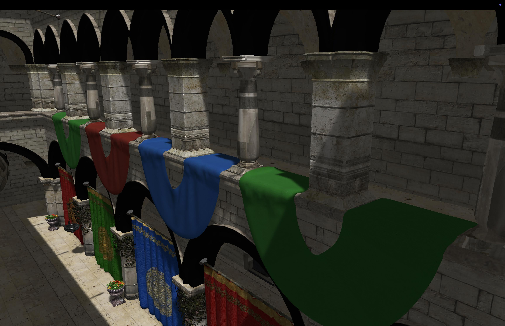

# 🖥️ Metal Renderer

A graphics engine built with Metal and Swift for rendering 3D scenes. This project was built as my introduction to the Metal API and swift, as well as to learn more computer graphics techniques for rasterization.

## 📝 Features

- Loads and renders USDZ models, supporting textures including normal maps and transparent materials with alpha clipping
- Implements a shadow pass for shadow mapping, implementing soft shadows with percentage-closer filtering using a Poisson disk distribution and reducing noise using comparison samplers

## 🔍 What I Learned

- Graphics programming with Metal and shader programming in the Metal Shader Language
- Configuring the rendering pipeline with an explicit graphics API, including the management of command queues, buffers, and encoders
- Mathematical foundations behind computer graphics techniques such as normal mapping and shadow mapping

## 🖼️ Results

Project files include a USDZ model of the Sponza scene, which was the primary scene used during development

## 📚 Reference

- [Apple's Metal API Tutorial](https://medium.com/@samuliak/apples-metal-api-tutorial-part-1-hello-window-8a806c988db4)
